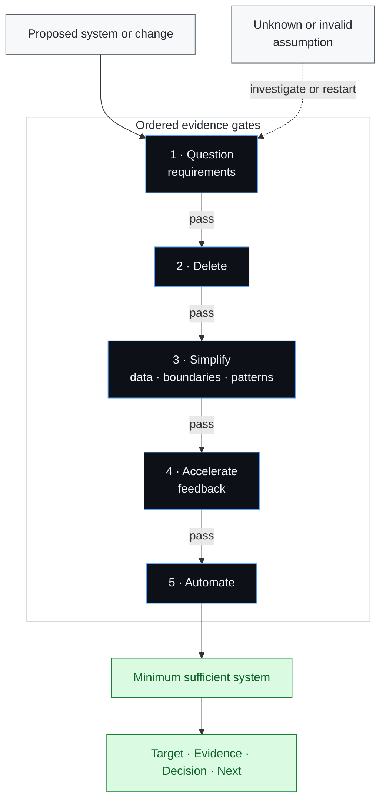

# Five-Step Engineering

An evidence-first Agent Skill for Codex, Claude Code, and Cursor. It now applies
the same first-principles discipline to data models, design patterns, and
software architecture: model valid state first, hide volatile decisions, and
make every abstraction earn its concepts.

> **Do not optimize something that has not earned the right to exist.**

## Architecture



Advance only when the current evidence gate passes. Stop at the first
consequential unknown; if an assumption breaks, restart at step 1.

## Origins

The process comes from Elon Musk's explanation during Tim Dodd's
[2021 Starbase tour interview](https://www.youtube.com/watch?v=t705r8ICkRw),
later popularized as
[“The Algorithm”](https://www.inc.com/jeff-haden/elon-musks-algorithm-a-5-step-process-to-dramatically-improve-nearly-everything-is-both-simple-brilliant.html)
in Walter Isaacson's *Elon Musk*.
This skill adds explicit evidence gates, reversibility safeguards, and a
decision-focused output for agentic engineering work.
Its [structural-design reference](five-step-engineering/references/structural-design.md)
distills primary work on data invariants, information hiding, quality scenarios,
and problem-first use of patterns.

## Install

Clone once:

```bash
git clone https://github.com/ZepinLi/five-step-engineering.git
cd five-step-engineering
```

Link the same skill into any client you use:

```bash
# Codex
mkdir -p ~/.codex/skills
ln -s "$PWD/five-step-engineering" ~/.codex/skills/five-step-engineering

# Claude Code
mkdir -p ~/.claude/skills
ln -s "$PWD/five-step-engineering" ~/.claude/skills/five-step-engineering

# Cursor
mkdir -p ~/.cursor/skills
ln -s "$PWD/five-step-engineering" ~/.cursor/skills/five-step-engineering
```

Restart the client or open a new agent session if the skill is not discovered
immediately. Cursor users can alternatively
[import the GitHub repository](https://cursor.com/docs/skills.md#installing-skills-from-github)
from **Customize → Rules → Add Rule → Remote Rule (GitHub)**.

## Use

| Client | Direct invocation |
| --- | --- |
| Codex | `$five-step-engineering evaluate whether we should add a cache.` |
| Claude Code | `/five-step-engineering evaluate whether we should add a cache.` |
| Cursor | `/five-step-engineering evaluate whether we should add a cache.` |

Codex uses explicit invocation. Claude Code and Cursor may also discover the
skill automatically from its description. The skill returns only the target,
evidence, decision, and smallest useful next step.

## Structure

```text
five-step-engineering/
├── README.md
├── LICENSE
└── five-step-engineering/
    ├── SKILL.md
    ├── references/
    │   └── structural-design.md
    └── agents/
        └── openai.yaml
```

The inner `five-step-engineering/` directory is the self-contained skill.

## License

[MIT](LICENSE)
